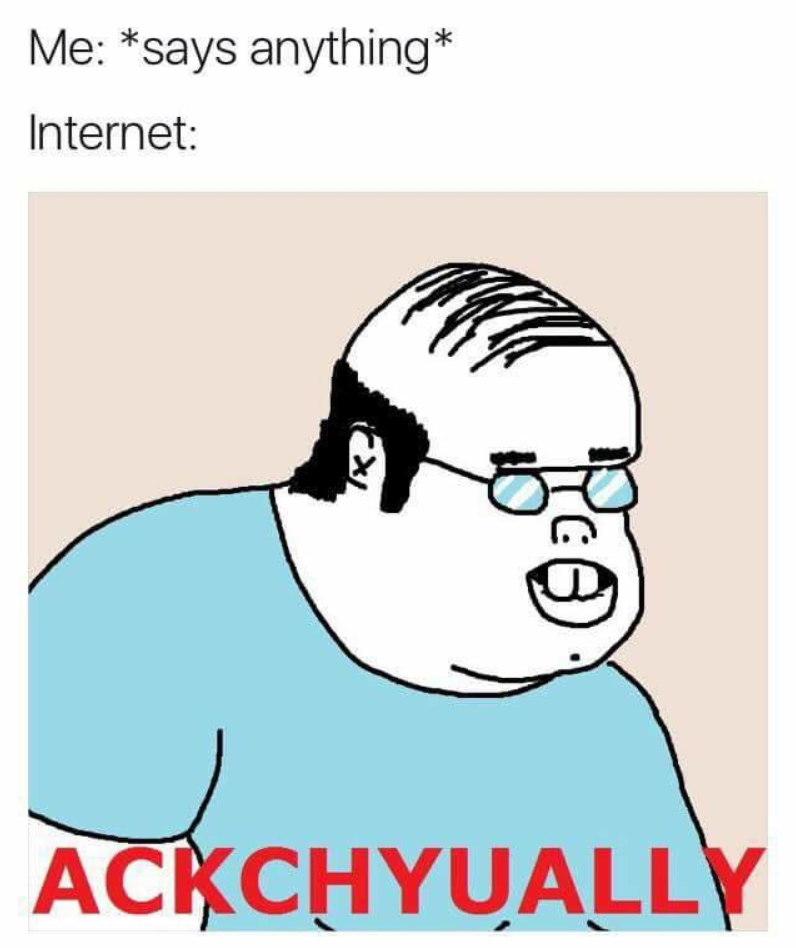

## You're*

I am a little ashamed to admit that when I was younger, I was the type of person who would correct a person's grammar or spelling online. As I grew older, I began to realize that everyone comes from different backgrounds and that English may not be a person's first language - even if it is, they might not place as much emphasis on correct spelling and grammar when posting online compared to say, a formal essay. "There", "their", and "they're" - when it comes to conversation, it really doesn't matter. People can understand meaning based on context rather than on an analysis of every single word and letter that is said or typed.

## Does Not Compute

Unfortunately, the same cannot be said about compilers. Writing a program in a language like Java and forget a semicolon? You're code won't execute, and your in for a world of hurt. Programming in C++ and try to assign a String to a variable declared as an integer? Their will be surely be a compile error. Fortunately, the compiler usually tells you exactly where the error is and it is easy to fix. But what about code that is readable by a machine, but nearly impossible for a human?

Consider the following function that takes an array of numbers and returns the maximum element from the array (written in JavaScript[^1]):

```js
        function A  
  (v){var
    h=0;for(
  I=0;I<v.length;I++){if
(v[I]			>h){h=v[I]}}
        return              h            }
```
Perfect! At least, according to the computer. The code executes and returns the correct value. For a human, however, it may cause a number of symptoms that range from eye twitching to a brain aneurysm.

The same function can be written as:
```js
function maxElement(numArray) {
  let max = 0;
  for(let num of numArray) {
    if (num > max) {
      max = num;
    }
  }
  return max;
}
```
A few simple coding standards that have been implemented in the second example:
- Proper indentation: Probably the biggest difference between the two functions in terms of readability is the indentation. In general, JavaScript indentations should be two spaces.
- Descriptive names: Naming functions and variables with names that describe what they do or what data they hold makes code much easier to follow - especially when you come back to it later.
- No var: In JavaScript, "var" declares a variable that is function-scoped. Using "let" declares a variable that is block-scoped.


## Code Analysis

How can software engineers avoid committing such heinous crimes? Enter ESLint: one of the most popular tools for analysing JavaScript code. While I do think that ESLint is a great tool, I will admit that I am not a big fan of a few things from the <a href="https://github.com/airbnb/javascript" target="_blank">AirBnb JavaScript Style Guide</a> that we are using in this course. Namely, little things like "no double-quoted strings", "no extra space at the end of a file", and "trailing comments in an object declaration" bug me. In the style guide, many of the standards have a "why?" section explaining the reasoning behind the standard. <a href="https://github.com/airbnb/javascript#strings--quotes" target="_blank">This section is omitted in the "no double-quoted strings" standard</a> (and other places as well). I am also more than slightly annoyed every time I see a red "error" but it turns out to be a *style* error, not an actual coding error.

It's like ESLint's way of saying, "ACTUALLY, it's **you're**."


---


[^1]: Let's forget about the Underscore library for a few minutes.
