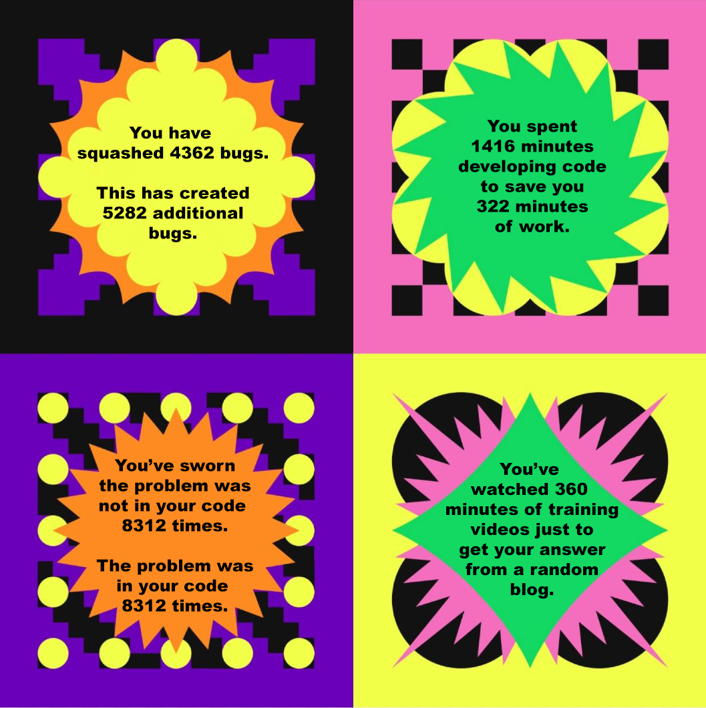

<figure class="rounded float-end ps-3">
    
    <figcaption style="text-align: center;">My <i>Spotify Wrapped</i> for 2022</figcaption>
</figure>

A well-rounded software engineer cannot be created in a few short months. Even after completing multiple semesters of computer science courses, I would still consider it quite a stretch to call myself a software engineer. Many computer science courses cover how to develop programs, but there are many aspects to software engineering that expand beyond simply writing code. Software engineers must be familiar with a wide variety of technologies, keep up with the various standards in the industry, understand different styles of project management, understand how to work as part of a development team... the list goes on. At first, one might balk at the wide breadth of information that software engineers are expected to know, but learning and implementing these fundamental concepts make life easier for everyone involved in software development. Two major aspects of software engineering today that expand beyond writing code are configuration management and coding standards.

**Configuration Management**

It is nearly certain that every professional software engineer today uses some sort of configuration management tool to maintain their codebase. Rather than simply overwriting old files with new changes, configuration management ensures the integrity of a codebase by creating a detailed record of every change that is made to a system. Additionally, configuration management helps ensure good communication and collaboration between team members by providing a central repository that holds all of the system's files. Each team member can copy this repository to their local machine and make changes without fear of damaging the entire system. Without configuration management, there is a lack of traceability: it is difficult to determine what changes were made to a system, when they were made, and what might have caused problems.

**Coding Standards**

Coding standards help ensure that code is consistent, easy to read, and easy to understand. By preventing common coding errors, coding standards can help make systems more secure and less prone to bugs. Additionally, coding standards help make code easier to maintain, because everyone working a system writes code the same way. Sometimes, coding standards might seem a little annoying, but in the long run they save time and effort, and improve the quality and reliability of code. Today, there are a number of integrated systems available that ensure that any new code being written conforms to specified coding standards.

**Conclusion**

It is possible to ignore these aspects of software engineering and simply learn how to write code. One could develop a project using Notepad as their IDE and the Windows Explorer as their configuration management system. However, when a bug is inadvertently introduced due to a typo, or a change is saved that bricks their system, or more people start to get involved in  development... configuration and coding standards quickly become a necessity. These are just two of the many fundamental concepts that all software engineers should know. I look forward to gaining a deeper understanding of these concepts and learning new concepts as I broaden my knowledge and progress toward my career as a software engineer.
