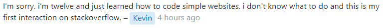

It is safe to say that nearly everyone who has visited an online forum has seen their fair share of stupid questions. Perhaps the most common example of a stupid (or "not-so-smart") question is a question that could easily be answered with a quick Google search or by simply reading the manual. Other examples include vague questions that don't provide enough details to be properly answered, questions that cry "urgent!" and demand an immediate answer, and questions that are off-topic for the forum in which they are posted.

In <a href="http://www.catb.org/esr/faqs/smart-questions.html" target="_blank">How To Ask Questions The Smart Way</a>, Eric Raymond breaks down some of the common problems with the way people ask questions and provides advice on how to ask better questions. Though the paper is a little outdated and at times comes off as a little snooty (in my humble opinion - hence the title of this essay), it provides some good advice for people who are searching for answers. A brief summary of how to ask a "smart" question:

- Before asking a question, *try to find an answer first* by searching the web, reading the manual, reading a FAQ, etc.

- When asking a question, make sure to:
    - Post it in the appropriate place
    - Use meaningful, specific subject headers (use "object - deviation" as a template)
    - Write in clear, grammatical, correctly-spelled language
    - Be precise and informative about the problem
    - Describe the problem's symptoms, not your guesses

In my opinion, one of the most important takeaways from the paper, and something to always remember when asking questions, is that you, as the question-asker, are asking for someone else's free time: when you post a question to a forum, you are asking others to sacrifice their time (for free!) to help you with your problems. It is necessary to exhaust all other options to answer the question yourself before putting it out there for the rest of the world to deal with.

Many examples of "smart" and "not-so-smart" questions can be found on <a href="https://stackoverflow.com/" target="_blank">Stack Overflow</a>.

### A "Smart" Question

Let's first briefly examine the question asked <a href="https://stackoverflow.com/questions/73654866/azure-pipelines-build-quality-checks-error-the-expression-is-not-a-valid-regula" target="_blank">here</a>:

  

Just by looking at the title, it's clear to see what system the user is using and what error they have encountered. The user shares the exact error from the terminal, followed by a snippet of code showing the REGEX pattern they used. The author then shares a link to the documentation, demonstrating that they have looked up how to solve this problem on their own. They also add that they've double-checked the REGEX pattern to make sure it is valid.

This user followed Raymond's advice by trying to find an answer first, using meaningful subject headers, writing clearly, and precisely describing the problem. The author also did not try to make the issue seem like an emergency or demand immediate action.

Though there are no accepted answers on the question yet (at the time of writing, it is still only a few hours old), when someone with experience in this area sees it, they should be able to understand the problem easily and provide an answer.

### A "Not-so-Smart" Question

On the other hand, <a href="https://stackoverflow.com/questions/73655378/i-dont-know-why-footer-wont-go-below-the-content" target="_blank">this question</a> does not meet the criteria to be considered "smart."
 

  

The title is not clear. While we can see from the tags on the question that the user is referring to html and css, it would be better if it was made apparent in the title; potential answerers should not have to search for this basic information. The body of the question simply repeats the title, but includes the useless addition, "I'm hopeless." The link "Help" leads to a photo of the user's website, where it is not clear which part is the footer or which part is the body. The user also did not include their code, so it is impossible to tell where the issue could be, and thus impossible to answer.

A few hours later, I checked the post again and saw that the user who had asked the question added this comment:

  

Well, okay, now I feel bad. We all started somewhere!
