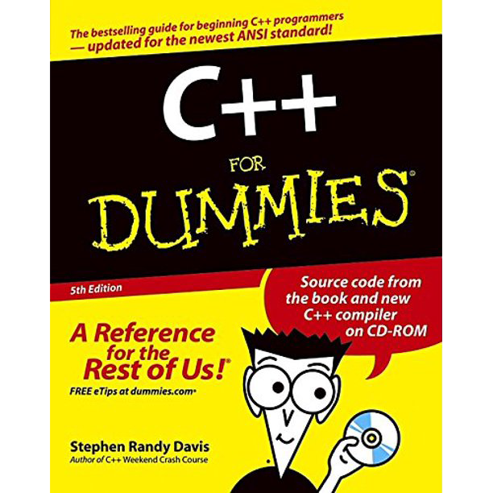
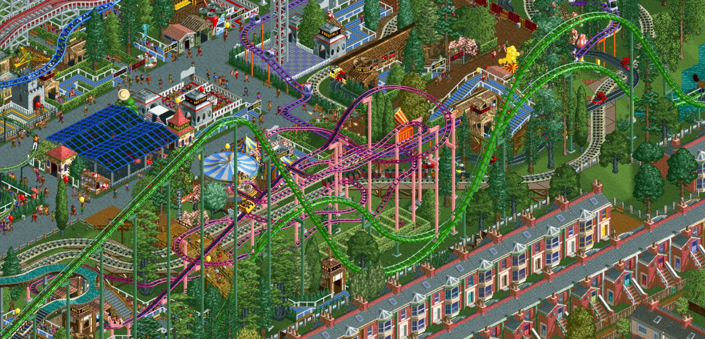

## Background

I first became interested in software engineering when I was in middle school. After spending hours playing games like *Roller Coaster Tycoon*\*, *Age of Empires II*, and *Pokemon*, I began to wonder how games like these were made and was curious if I could learn how to create my own games. My parents eventually bought me a copy of *C++ For Dummies*, and I started to learn how to code by clumsily following along with the book. After a few frustrating weeks of unsuccessfully trying to understand the programming concepts that were covered, I gave up and decided that I probably wasn't smart enough to write code. Fifteen years later, I have once again embarked on a quest to become a software engineer, albeit this time with more self-confidence and determination. I am enjoying the journey so far.

## Interests

Lately, I have been interested in application design (specifically mobile applications). I enjoy finding ways to create user interfaces that are intuitive and aesthetically pleasing. Today, I find myself spending the vast majority of my free time writing code. Some of my other interests include cryptography (I am a fan of the <a href="https://signalfoundation.org/en/" target="_blank">Signal Foundation</a>), blockchain technologies, and cryptocurrencies. I am also interested in augmented reality, and I believe that within the next ten to twenty years augmented reality will become a major part of our daily lives.

## Future Plans

During my time at the University of Hawaii, I hope to develop a solid foundation in the field of computer science and connect with like-minded people to collaborate with. I hope to develop a deeper understanding of cryptography and blockchain technology by building my own projects that implement these concepts. My ultimate goal is to be in a position where I can put my time and effort into contributing to projects that I believe make the world a better place.

 

*\*Footnote: Chris Sawyer single-handedly wrote all of code for Roller Coaster Tycoon. 99% of the game was written in Assembly, with the remaining one percent written in C.*
