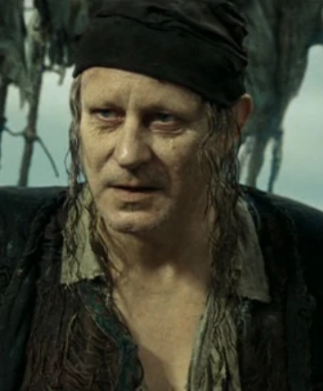
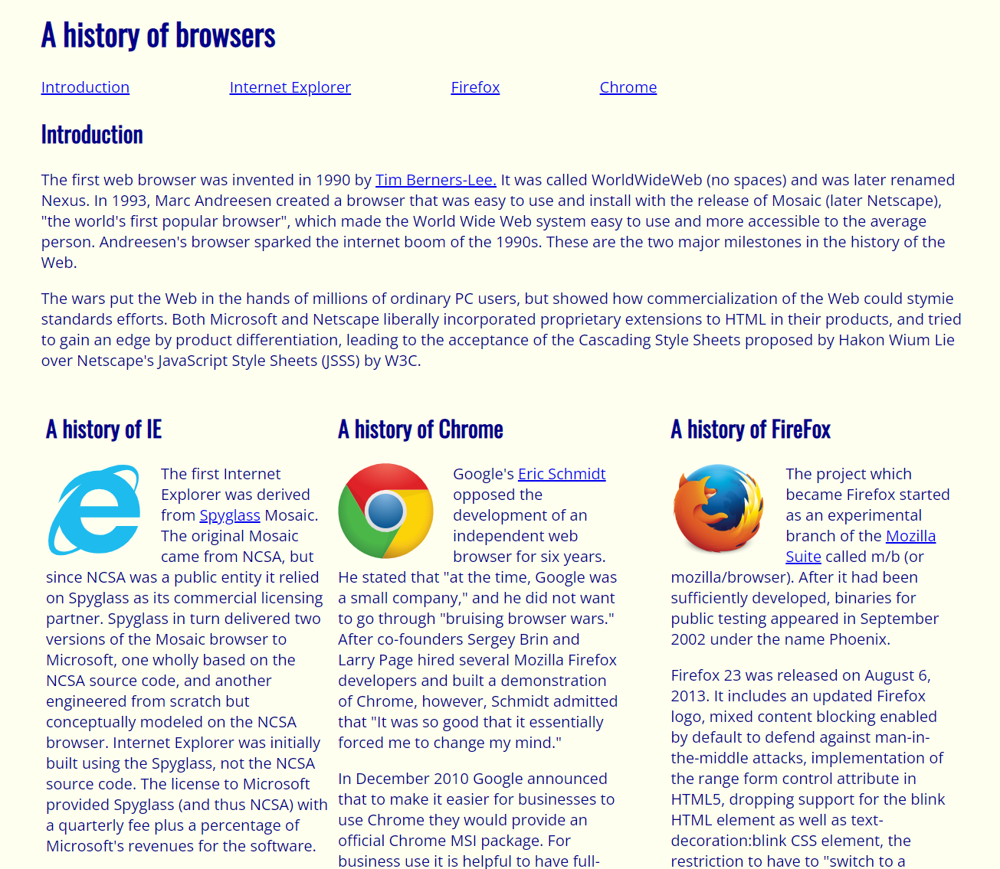
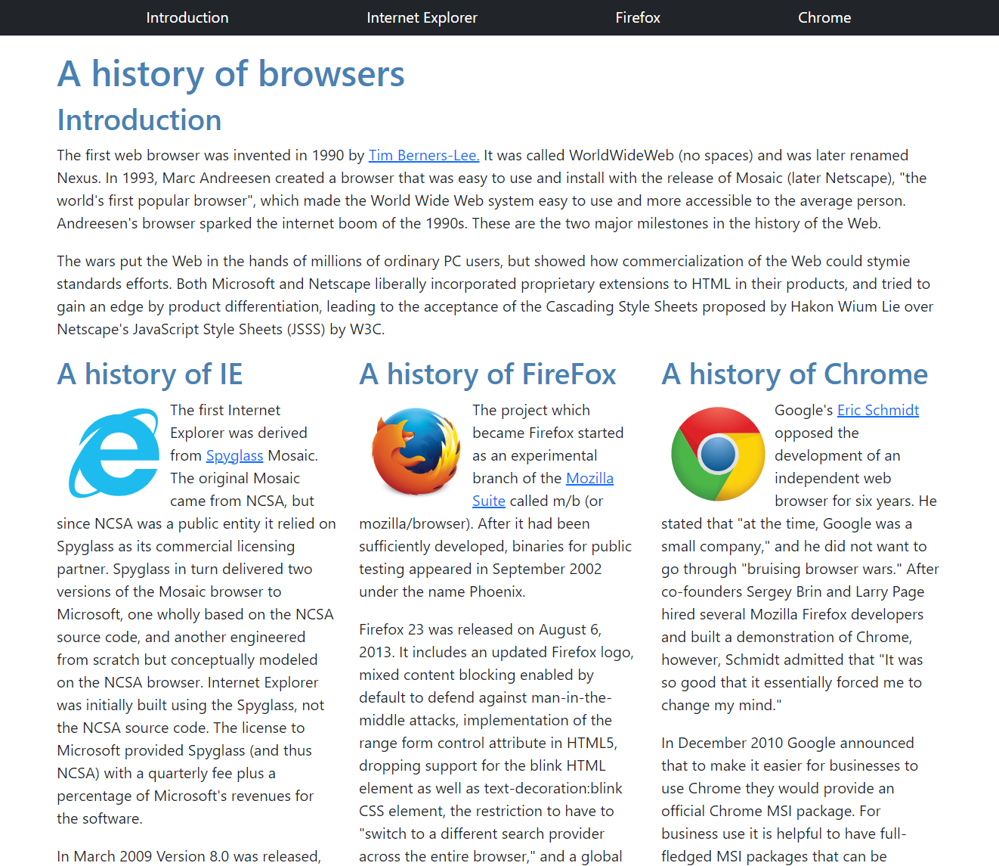

<figure class="rounded float-end ps-3">
    
    <figcaption style="text-align: center;"><i>"One day on land, ten years at sea."</i></figcaption>
</figure>

## Bootstrap Bill

Before learning about UI frameworks, the majority of my time coding in HTML and CSS was spent Googling how to set up and align the various elements of a webpage (and the only Bootstrap I knew was a pirate from a Disney movie). There must be dozens of searches in my browser history for things like "how to set up columns and rows," "how to center an image," and other seemingly simple things that may or may not be difficult to achieve in pure HTML/CSS, depending on your experience level. Regardless, UI frameworks such as Twitter Bootstrap make life much easier.

## A Simple Example

We were assigned to create a simple website using HTML and CSS that displayed a brief history of web browsers (below, left). You can see that the resulting webpage is not ideal. The biggest issue is the column margins (the other styling choices such as font and color can easily be modified in CSS). The next assignment was to recreate the website using Twitter Bootstrap (below, right). As you can see, the result looks much better. The columns are properly aligned, the default Bootstrap font is clean, and that top menu? 

<br>

<div class="row">
  <div class="col">
    <figure>
      
      <figcaption class="py-1" style="text-align: center;"><i>"One day on land, ten years at sea."</i></figcaption>
  </figure>
  </div>
  <div class="col">
    <figure>
      
      <figcaption class="py-1" style="text-align: center;"><i>"One day on land, ten years at sea."</i></figcaption>
    </figure>
  </div>
</div>

Halfway through writing this essay, I realized that the Techfolios website I am currently writing on uses Twitter Bootstrap as its UI framework. Notice how those those two screenshots above are nicely aligned in two columns? And they can scale depending on the size of the browser window. The best part is, I didn't even have to Google "align two images center in two columns bootstrap," because Bootstrap's syntax is so easy to remember and to implement. The code for the two images above:

```html
<div class="row">
  <div class="col">
    <figure>
      
      <figcaption style="text-align: center;"><i>"One day on land, ten years at sea."</i></figcaption>
  </figure>
  </div>
  <div class="col">
    <figure>
      
      <figcaption style="text-align: center;"><i>"One day on land, ten years at sea."</i></figcaption>
    </figure>
  </div>
</div>
```
