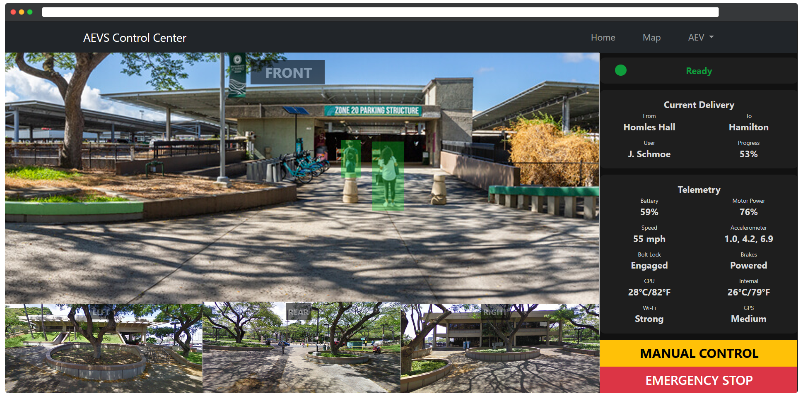
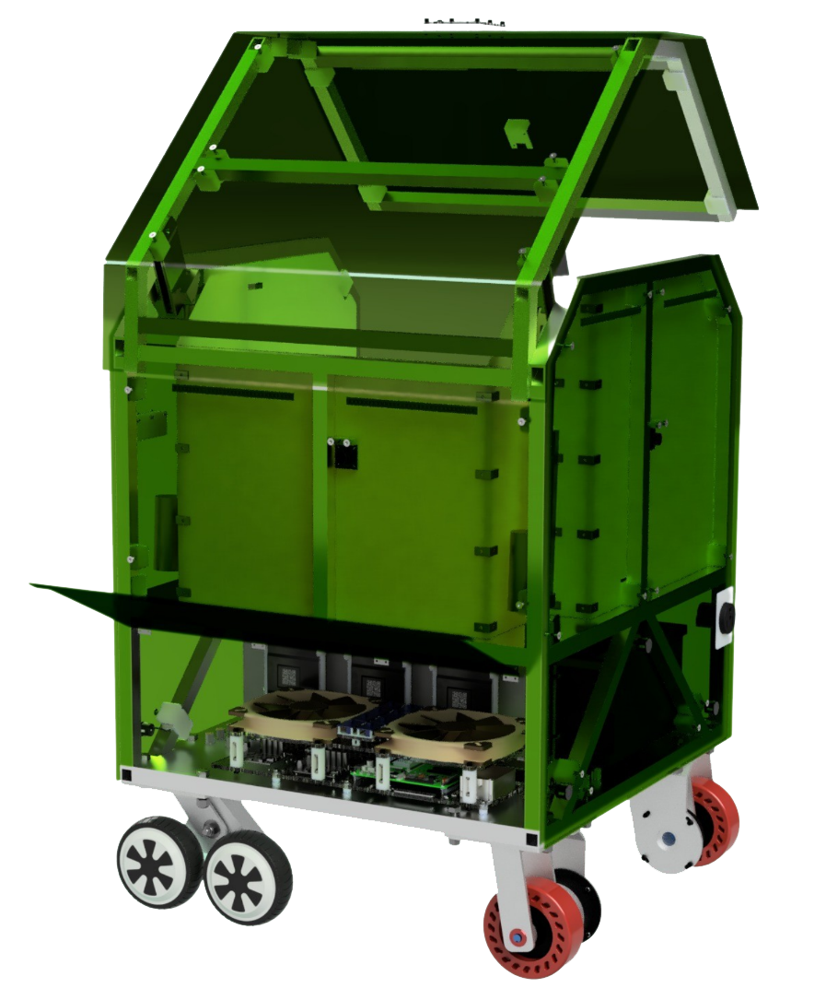

  

The Autonomous Electric Vehicle System (AEVS) is a Vertically Integrated Project (VIP) for the College of Engineering at the University of Hawai'i at Manoa. VIP consists of mechanical engineering students who complete the project in their final year, and volunteers from other majors. The project's goal is fully autonomous delivery of packages around the UH Manoa campus.

The software side of the AEVS is broken up into three major components:
- The user website, where users can schedule and modify deliveries (Node.js, Express, MongoDB)
- The control center, where a team member can monitor AEV status and manually control the AEV if necessary (Node.js, Express)
- The AEV itself (NVIDA's Python AI libraries for object detection and avoidance, running a server built with Flask to stream video, relay telemetry, and receive remote commands)

  

  

    
  

  

    
  

  

    Linear actuators opening the AEV's door (command received remotely from the user website)
  

  

    The AEV in operation (remotely controlled over the internet via the command center website)
  

 

  <a href="https://github.com/HACC-Cassiopeia/Legislative-Scraper-Production" target="_blank">GitHub Repository</a>

