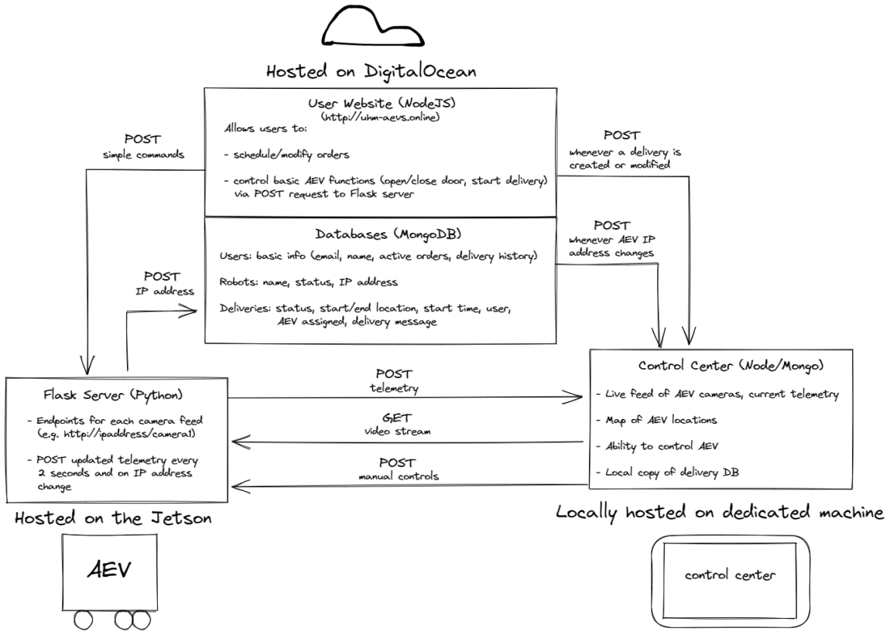

  

The Autonomous Electric Vehicle System (AEVS) is a Vertically Integrated Project (VIP) for the College of Engineering at the University of Hawai'i at Manoa. VIPs are run by of a team of senior mechanical engineering students who work together on a capstone project in their final year of undergraduate study. These teams are augmented by volunteers from other majors including electrical engineering, computer engineering, and computer science.

The AEVS project's goal is fully autonomous delivery of packages around the UH Manoa campus. This year's AEVS team essentially redesigned and rebuilt the entire robot from scratch, keeping only minor details from the previous year's team. I joined the team midway through spring semester and was the only computer science major on the team, despite the fact that the project heavily relies on advanced computer science concepts such as artificial intelligence and computer vision.

The software side of the AEVS is broken up into three major components:
- [The user website](https://uhm-aevs.online), where users can schedule/modify deliveries and issue simple commands to the AEV such as opening and closing the door. This application was built using Node.js, Express, and MongoDB.
- [The control center](https://uhm-aevs.online:3000), where team members can monitor AEV status and manually control the AEV if necessary. This application was also built with Node.js and Express.
- The code running on the AEV (a [NVIDIA Jetson TX2](https://www.nvidia.com/en-us/autonomous-machines/embedded-systems/jetson-tx2/)). This code was primarily written in Python and uses NVIDA's AI libraries for object detection and avoidance. It also serves a Flask application for streaming video, relaying telemetry data, and receiving remote commands.

 

  

  An overview of how the three software systems communicate with each other.

 
As the only computer science major on the team, I was responsible for writing nearly all of the code for the AEVS. I started by building the user website and the control center. Once the other team members had made enough progress building the AEV, I was able to begin working on the AEV's code and testing mechanical functions such as motor controls, linear actuators, warning lights, sound, telemetry, and object detection. These functions were integrated using various tools including [Phidgets](https://www.phidgets.com/), the [Jetson General Purpose I/O](https://github.com/NVIDIA/jetson-gpio) (GPIO) library, and  Serial Protocol Interface (SPI) .

 There was a lot for me to learn on this project. While I had developed web applications before, this was my first time using Node.js and Express.js. Throughout the development of these applications, I was able to learn more about HTTP methods, routes, and how to set up my own APIs. This was also my first time programming an embedded system, which I thoroughly enjoyed and would like to try again in the future.

 I joined quite late in the project and I was not able to achieve the goals that the team had, namely autonomy. If I am able to work on this project again next year, I would like to start developing the software as soon as possible - specifically computer vision. I would also like to implement Socket.IO as the communication channel between the AEV and the control center rather than HTTP, which would help ensure constant communication between the two systems. While there was not enough time to complete every goal we had for the project, I am still proud of what we accomplished and I was grateful for the opportunity to learn more about programming embedded systems.

  

    
  

  

    
  

  

    Linear actuators opening the AEV's door (command received remotely from the user website)
  

  

    The AEV in operation (remotely controlled via the command center website)
  

 

  <a href="https://github.com/ME-481-AEVS" target="_blank">GitHub Organization</a>

