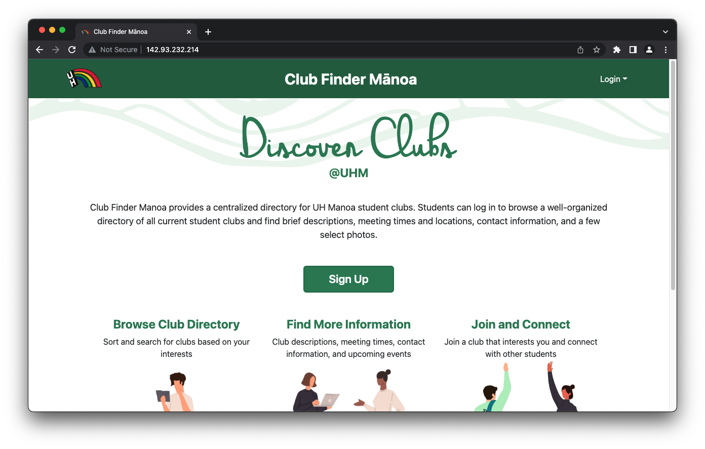
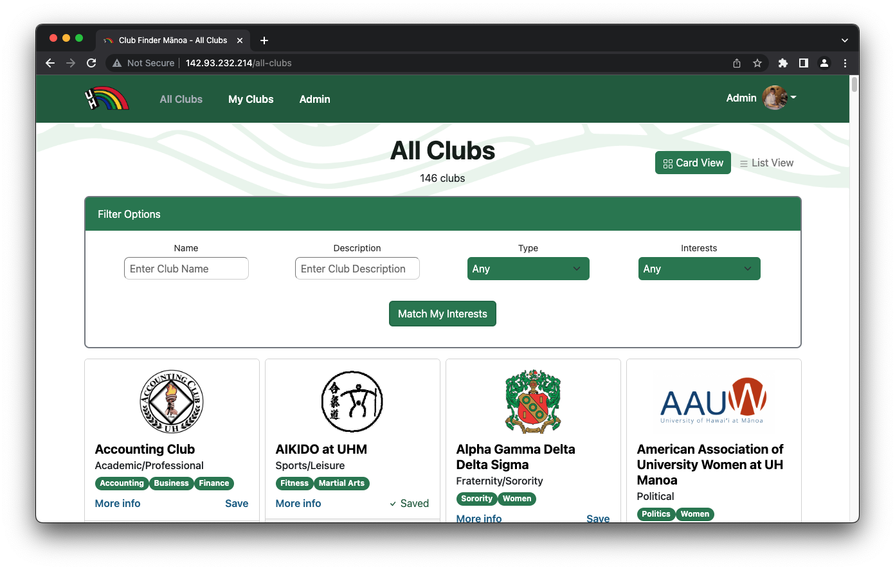
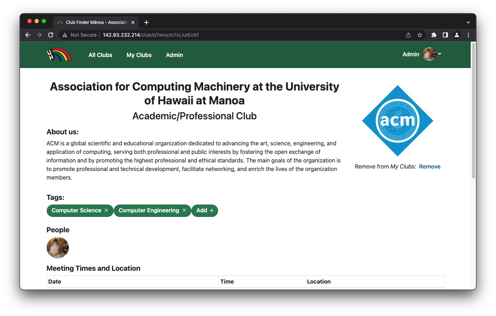
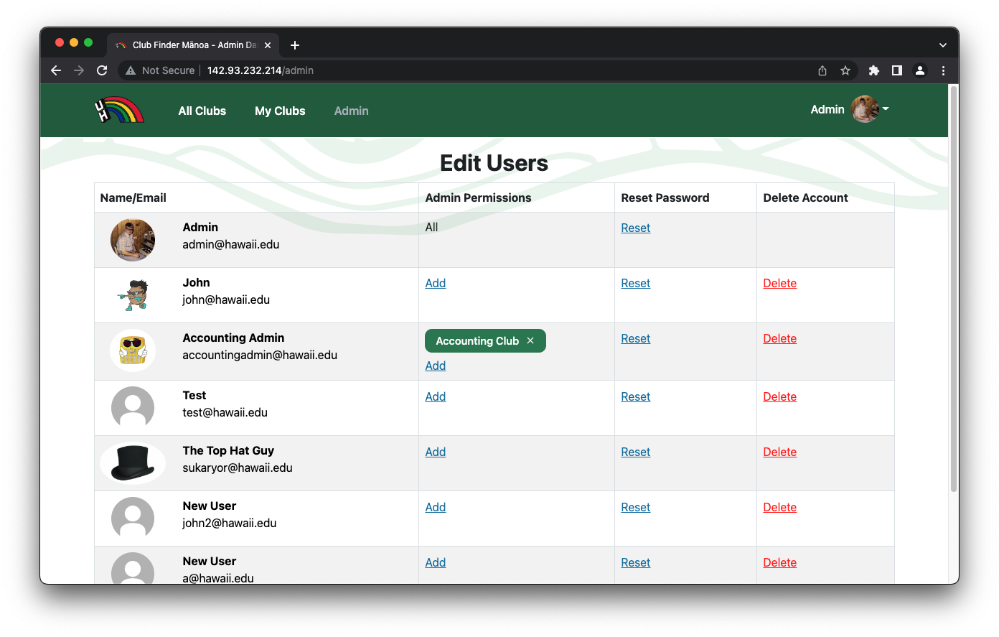

  

There are over 200 registered independent organizations (aka clubs) at the University of Hawaii at Manoa, but there is no easy way for students to learn what clubs exist, what they do, and how to get further involved. Club Finder Manoa provides a centralized directory for student clubs: students can log in and browse a well-organized directory of all current student clubs with brief descriptions, meeting times and locations, URLs to club websites, and contact information for officers.

Club Finder Manoa was created as a team final project for ICS 314 - Software Engineering. The team consisted of myself and four other students: Destynee Fagaragan, Galen Chang, Gwyneth Raquepo, and Jayson Iwanaka. The application was built with MeteorJS: the frontend was built with React/Bootstrap and the backend was built with MongoDB. Throughout the development of the app, we collaborated via GitHub for hosting our repository and tracking issues, and Discord for meetings and chat-based communication. We implemented the Agile methodology approach to software development - after each meeting, team members took on specific tasks and issues to be completed before our next milestone. We met multiple times each week to make sure that we were all on the same page.

I worked on both the frontend and the backend on this project. For the frontend, I designed a number of pages including the landing page, admin page, and signup page. I also styled each page of the application and created the filter and search functions on the "All Clubs" page. For the backend, I created the various collections that are used in the application, helped load them with data, and implemented the functions necessary to link the database with the frontend. Additionally, I helped write and integrate the unit tests for the application using TestCafe. This was the second moderately-sized web application that I have worked on and the second software project that I have worked on collaboratively as part of a team. While developing this project, I learned more about Meteor, MongoDB, and React. I also learned how to implement unit tests and continuous integration with TestCafe and Github Actions.

  

  List of all of the clubs in the database

 

  

  View more detailed information about a specific club

 

  

  Admin page to view and edit users

 
 

  More details can be found at our <a href="https://club-finder-manoa.github.io/" target="_blank">project page</a>.
    
  <a href="https://github.com/club-finder-manoa/club-finder-manoa" target="_blank">GitHub Repository</a>

