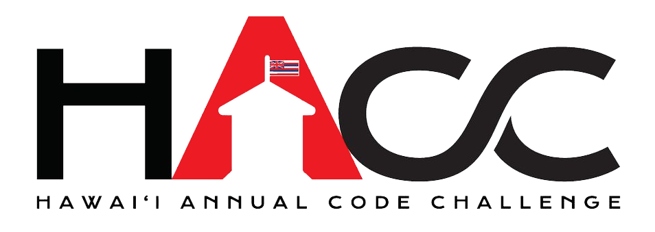
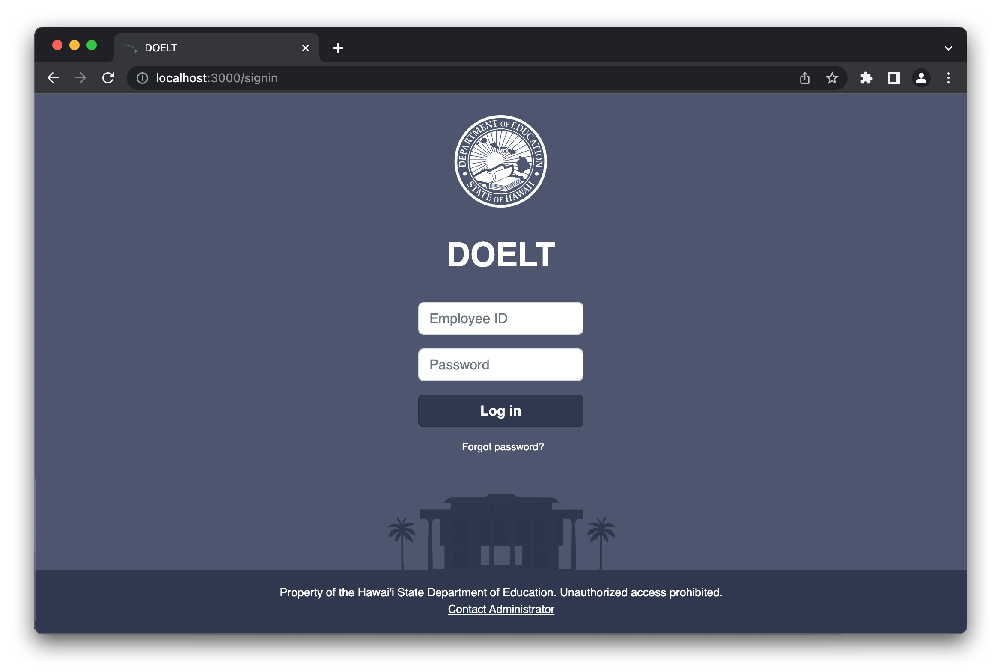
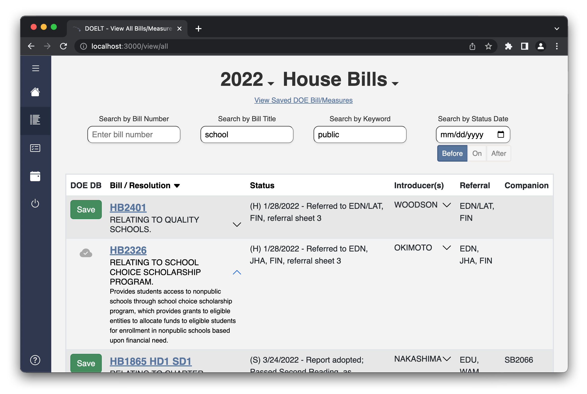
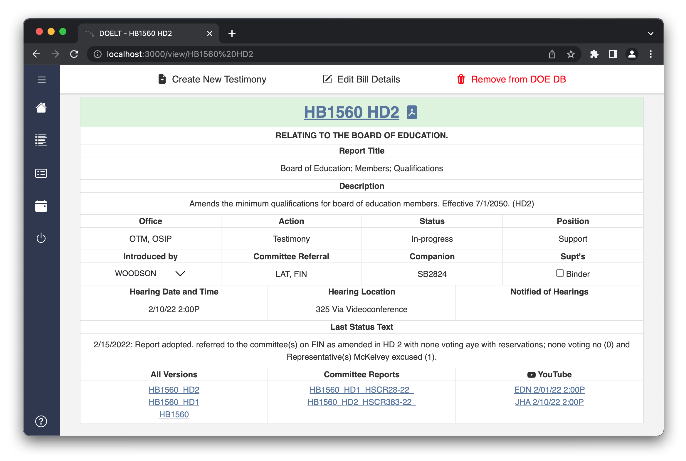
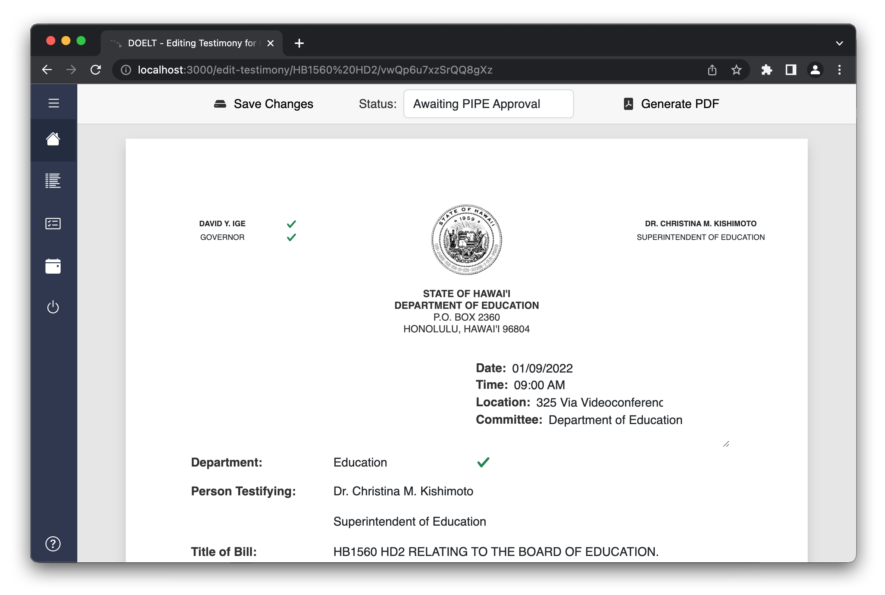

  <i>This application was developed for the Hawai'i Annual Code Challenge (HACC) 2022, where it came in 2nd place out of 44 teams.</i>

  

  

Department of Education Legislative Tracker (DOELT) is a web application that is designed to replace the Hawaii DOE's current legislative tracking system, which is over twenty years old and is no longer maintained. DOELT is a modern, user-friendly application that allows users to seamlessly track and save bills, edit and approve testimonies, and keep track of upcoming hearings through an integrated calendar. The application integrates a custom-built scraper to ensure it always displays the latest legislative information from the state capitol's website.

DOELT was built with MeteorJS: the frontend was built with React, Bootstrap, and the FullCalendar library, the backend was built with MongoDB, and the scrapers were built with Axios, Express JS, and Cheerio. The team consisted of myself and four other students: Ana Catarina Oliveira Araújo, Giorgio Tran, Kayla Hirano, and Shin Saito. Throughout the development of the app, we collaborated via GitHub for hosting our repository and tracking issues, and Discord for meetings and chat-based communication. Each team member took on specific tasks and issues and we met multiple times each week to make sure that we were all on the same page.

I mainly focused on the frontend and the user interface for this project. I designed the login page, styled the navbar and the dashboard pages, created the testimony PDF editor and saver, and designed the 'Bill Details' page. I also helped with the filter and search functions and with linking the UI with the scraped data and the data from the database. Additionally, I created the video that was used as our submission to the HACC. This was the first time that I have worked as part of a group to develop an application, and the first hackathon I have taken part of. I learned how to use Git for collaboration, including when to branch, when to merge, and how to solve merge conflicts. I also learned the ins and outs of Meteor and MongoDB, how to set up a database, define schema, and link the database with the user interface.

<figure class="mt-5">
  

    <iframe width="600" height="350" src="https://www.youtube.com/embed/0rt54E251uU" title="YouTube video player" frameborder="0" allow="accelerometer; autoplay; clipboard-write; encrypted-media; gyroscope; picture-in-picture" allowfullscreen>
    </iframe>
    <figcaption class="text-center">HACC 2022 Submission Video</figcaption>
  

</figure>

  

  View and sort a list of all of the bills from the capitol's website.

  

  View and edit specific bill's details.

  

  Edit, save, and submit PDF testimonies.

 

  <a href="https://github.com/HACC-Cassiopeia/Legislative-Scraper-Production" target="_blank">GitHub Repository</a>

