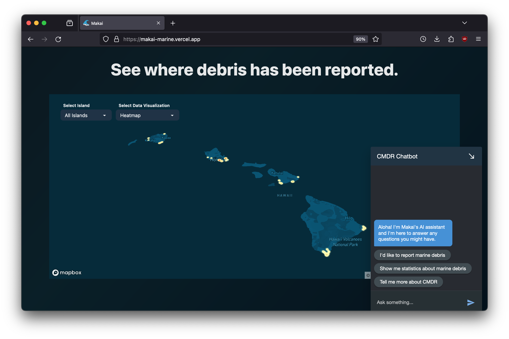
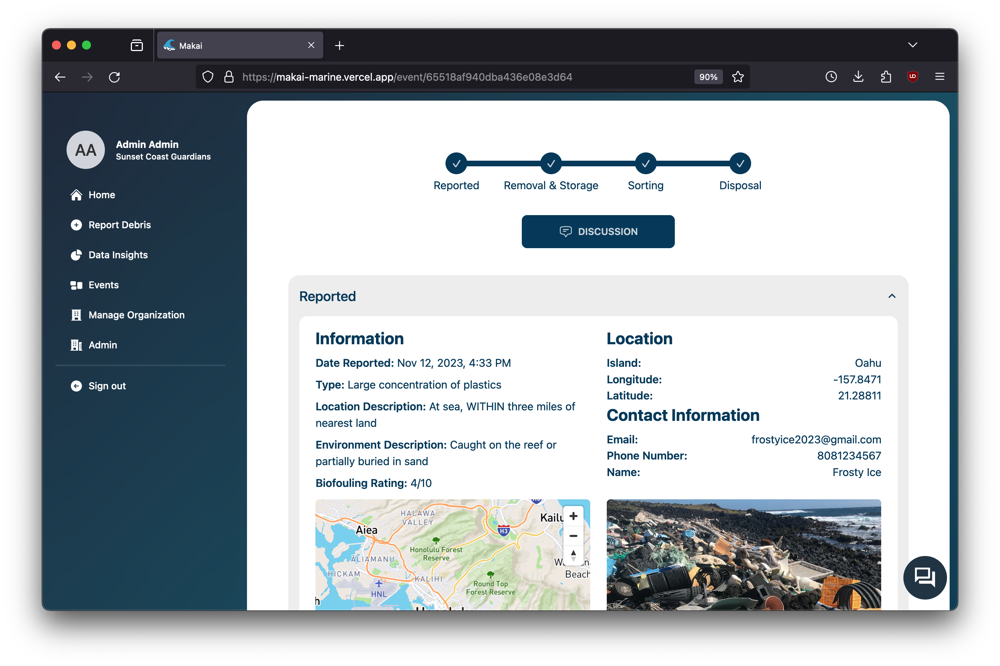
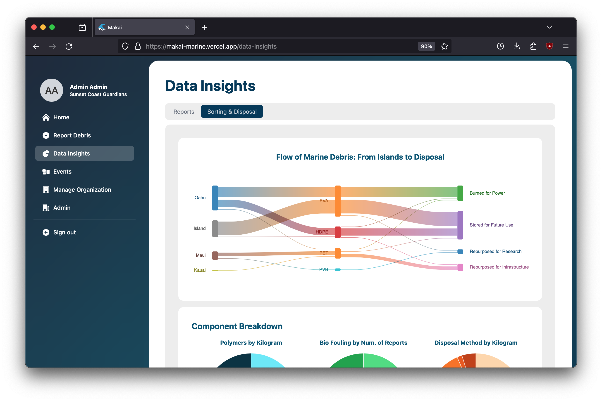

  <i>Makai was developed for the Hawai'i Annual Code Challenge (HACC) 2023, where it came in 3rd place out of 41 teams.</i>

The removal and disposal of marine debris is a complicated process that involves a lot of moving pieces and requires the collaboration of a number of different organizations throughout the islands. The Center for Marine Debris Research (CMDR) did not have a good system to track marine debris through the process of reporting, removal, storage, sorting, and disposal, and lacked a centralized database to track marine debris data. As a result, accurate tracking was challenging, and data analysis was nearly impossible. My team created Makai as a solution to this problem. Makai is intended for use by both the public and organizations responsible for large debris removal and features a centralized database that stores all debris reports in one place, enabling marine debris researchers to accurately monitor types of debris and debris hotspots, track current status of debris removal and disposal, and generate meaningful statistics that can be used to further study marine debris.

Makai was built with Next.js. The frontend was built with React, Tailwind, and DaisyUI, and MongoDB was used for the backend. We used Google's Dialogflow CX to create a chatbot for the website, as well as an automated call center for new marine debris reports. The team consisted of myself and four other computer science students: Ana Catarina Oliveira Araújo, Giorgio Tran, James Louie Grande, and Shin Saito. Throughout the development of the app, we collaborated via GitHub for hosting our repository and tracking issues, and Discord for meetings and chat-based communication. Each team member took on specific tasks and issues and we met multiple times each week to make sure that we were all on the same page.

  

  A heatmap on the landing page displays the location of marine debris reports throughout the islands. Users can also use the chatbot to learn more about marine debris.

  

  Users can track a specific marine debris report, from the initial report to disposal.

  

  A major feature of Makai is the generation of statistics. This Sankey diagram shows the flow of marine debris from each island, to debris type, to disposal method.

 

  <a href="https://github.com/HACC-2023/makai" target="_blank">GitHub Repository</a>
  <a href="https://makai-marine.vercel.app/" target="_blank">Live website</a>

