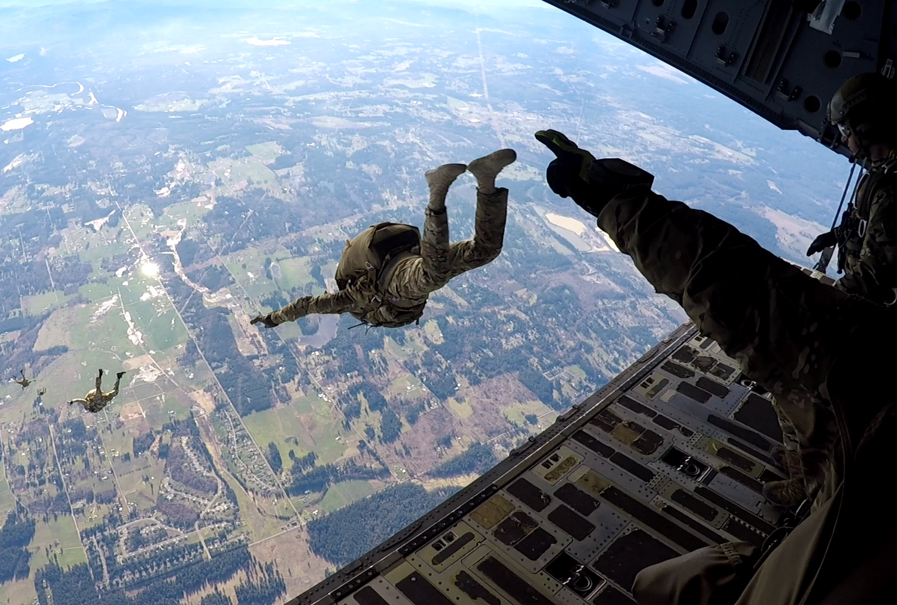
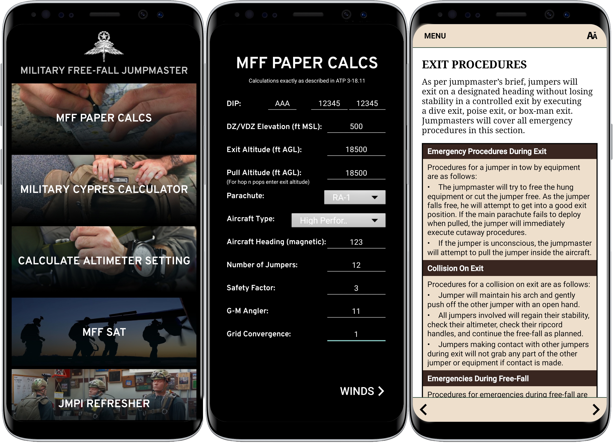

MFFJM is an Android application developed for Military Free-Fall Jumpmasters (MFFJM). Jumpmasters are able to enter data for a jump and, given the winds from ground level to the exit altitude, the application calculates the high-altitude release point, opening point, and distance/heading to the desired impact point (IAW the guidelines described in ATP 3-18.11). The app also includes a Military CYPRES calculator, altimeter calculator, and MFF sustained airborne training, making it a one-stop shop for MFFJMs.

I created this project after learning Java in ICS 111. I first built a text-based version of jump calculator and eventually moved it to Android. This was my first experience developing for Android and I learned the basics of Android Studio including the activity lifecycle, how to set up layouts with XML, how to configure the manifest file, and how to link resources. I never published the application, but I was able to use it a few times while I was still in the military.

 

  

  <a href="https://github.com/robertgodfrey/MFFJM" target="_blank">GitHub Repository</a>

