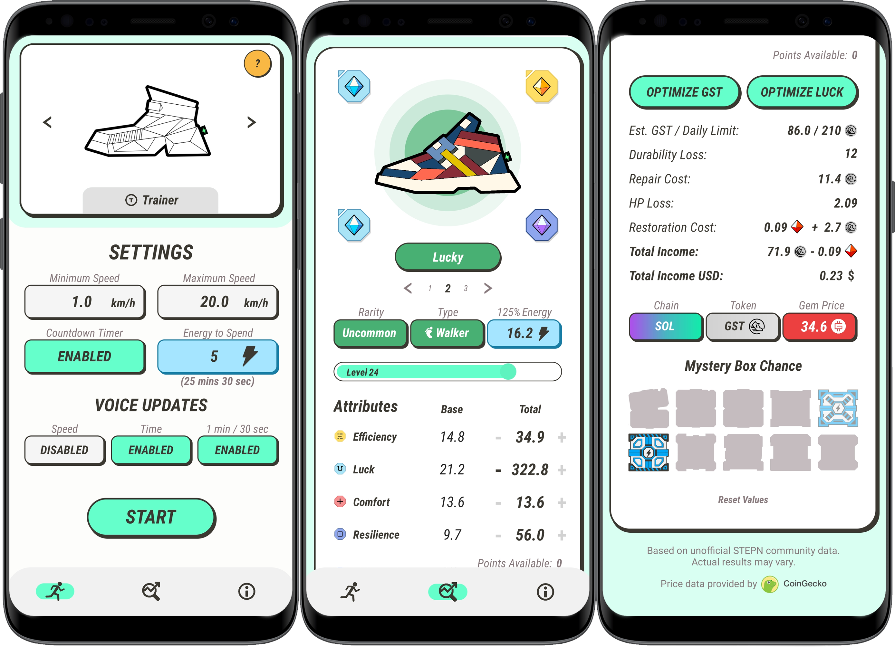

STEPN Sidekick is a mobile application that I started working on in the summer of 2022. Created as a companion application for the popular <a href="https://time.com/6207679/move-to-earn-apps-crypto-fitness/" target="_blank">move-to-earn</a> game <a href="https://stepn.com" target="_blank">STEPN</a>, STEPN Sidekick helps players optimize their in-game sneakers and gives users audible speed and time alerts while they exercise. The application was originally built natively for Android with Java was entirely rebuilt for iOS with Swift/SwiftUI.

This is by far the largest project I have created, and I learned a lot while making it. One of my main focuses was to create an intuitive user interface and to give the app a polished and professional feeling. To accomplish this, I learned how to implement design features such as button animation, tab views, and custom popup dialogs. I further broadened my knowledge of Android development with the implementation of features such as user location, audio, multithreading, foreground services, API calls, advertisements, and in-app purchases. Then, I learned it all again for iOS. This was the first project that I have published and it was my first experience using Swift & Xcode. Additionally, I translated the entire app into Korean (with some help).

At the time of this writing, STEPN Sidekick currently has over 10,000 downloads across iOS and Android. Its average rating is 4.9/5.0 on the Google Play Store and 5.0/5.0 on the Apple App Store.
  

  

  
  

  <a href="https://github.com/robertgodfrey/STEPN-Sidekick" target="_blank">GitHub Repository (Android)</a>
  &emsp; &emsp;
  <a href="https://github.com/robertgodfrey/STEPN-Sidekick-iOS" target="_blank">GitHub Repository (iOS)</a> &emsp;

