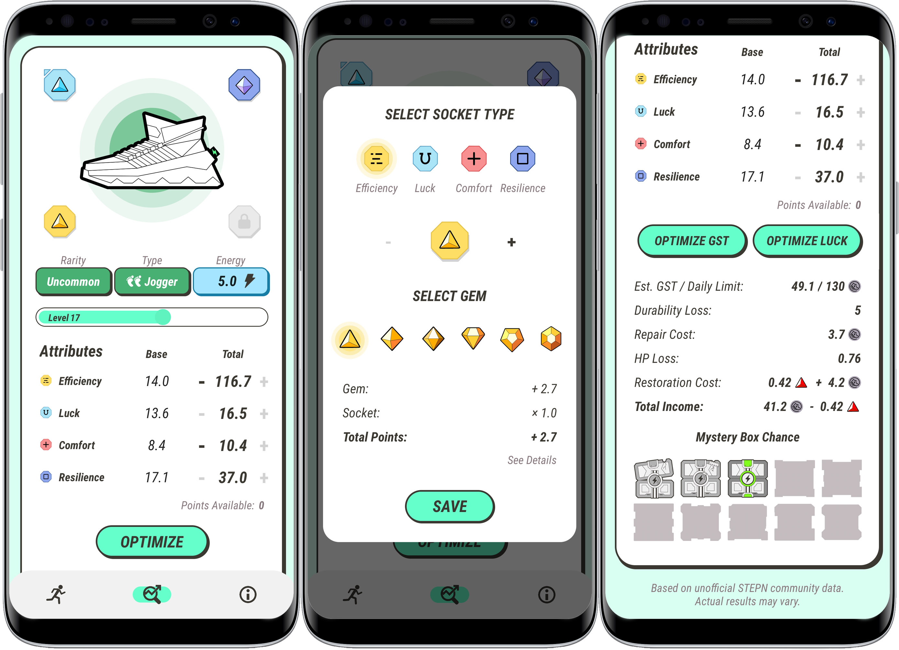

STEPN Sidekick is a mobile application that I developed during summer break 2022. Created as a companion application for the popular move-to-earn game STEPN, STEPN Sidekick helps players optimize their in-game sneakers and gives audible speed and time alerts while the user walks/jogs/runs. The application was originally built natively for Android (Java & XML) and is in the process of being rebuilt natively for iOS (Swift/SwiftUI). 

I learned a lot while working on this project. One of my main focuses was creating a user interface that is simple, smooth, and intuitive. This is the first project that I have published and it is my first experience using Swift & Xcode. I also broadened my knowledge of Android Studio with the implementation of features such as user location, audio, foreground services, API calls, advertisements, and in-app purchases, to name a few. I also translated the app entirely into Korean (with some help). 

STEPN Sidekick currently has over 2,500 downloads on the Google Play Store with an average rating of 5.0. 

[Google Play Store](https://play.google.com/store/apps/details?id=stepn.sidekick.stepnsidekick)

[Github (Android)](https://github.com/robertgodfrey/STEPN-Sidekick)

[Github (iOS)](https://github.com/robertgodfrey/STEPN-Sidekick-iOS)
