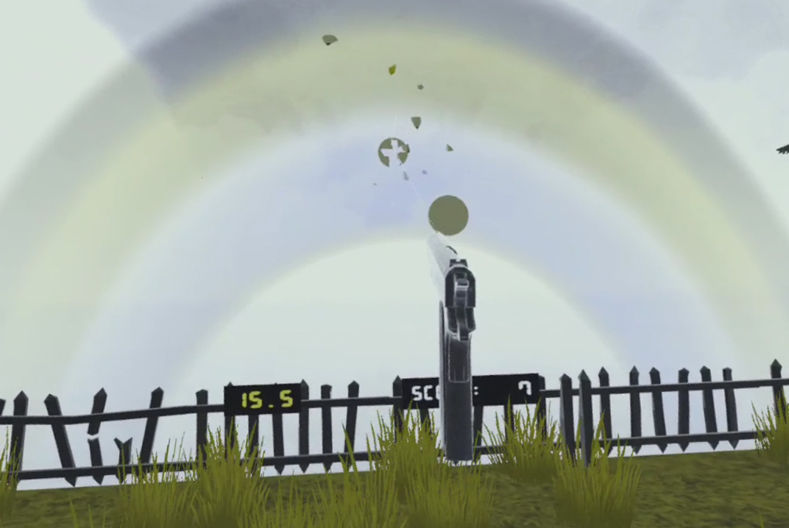
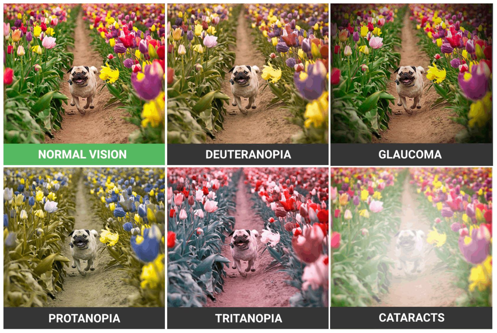

The VR Visual Impairment Simulator is a virtual reality game that lets users to experience various visual impairments, including cataracts, glaucoma, and three different types of colorblindness. After trying out the different impairments at the beginning of the game, users can play a shooting game where they try to shoot flying red and green-colored disks. Shooting the green disks scores one point, and shooting the red disk deducts two points. With normal vision, it is easy to tell the disks apart, but with the impairment filters applied, distinguishing between the two colors becomes much more difficult. The game was designed with the goal of helping people experience how simple tasks can become more difficult for those with vision impairments.  

This game was created in Unity. I developed this game with two other computer science students, Giorgio Tran and Christopher Lee.

  

    

      
    

    
A screenshot of the shooting game with the protanopia filter applied. The user has just incorrectly shot a red disk.

  

  

    

      
    

    
Examples of the visual impairments that can be experienced in the game. 

  

<figure class="mt-5">
  

    <iframe width="600" height="350" src="https://www.youtube.com/embed/_9xUgKAa2QE?si=lSMEaqe_khtgZtTU" title="YouTube video player" frameborder="0" allow="accelerometer; autoplay; clipboard-write; encrypted-media; gyroscope; picture-in-picture" allowfullscreen>
    </iframe>
    <figcaption class="text-center small">Video demo</figcaption>
  

</figure>

  <a href="https://github.com/ARVR-TEAM-7/disability-simulator" target="_blank">GitHub Repository</a>

